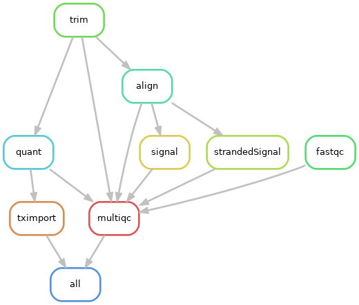

# bagPipes
***********************

## Overview
***********************
bagPipes is a collection of next-gen sequencing processing pipelines for the Phanstiel Lab.

bagPipes includes pipelines for paired-end RNA-seq data, ChIP-seq/CUT&RUN data, and ATAC-seq data using the Snakemake framework.

This pipeline is inteded to be run on the UNC HPC longleaf cluster with SLURM.

### TABLE OF CONTENTS
- [Quickstart](#quickstart)
- [About RNApipe](#about-rnapipe)
- [About ChIPpipe and ATACpipe](#about-chippipe-and-atacpipe)
- [Merging signal tracks](#merging-signal-tracks)
- [Benchmarking](#benchmarking)
- [Unlocking](#unlocking)
- [To Do](#to-do)

## Quickstart
-----------------------
The individual pipelines of `bagPipes` are run in very similar ways, with differences in their config `.yaml` files that can be used to fine tune runs. When using default settings, the general steps for all pipelines are as follows:

1. Clone workflow into working direcotry:

    ```bash
    git clone https://github.com/ksmetz/bagPipes.git .
    ```

2. Edit the tab-separated `samplesheet.txt` file with the names of `Read1` and `Read2` gzipped fastq files, and the paths to these files under the `Sequencing_Directory` column. No naming convention is needed. Any number of optional columns can be included for metadata, output file naming, and sample merging. An example is shown below:

    | Project   | Cell_Type | Genotype	| Bio_Rep	| Tech_Rep	| Seq_Rep	| Read1 | Read2 | Sequencing_Directory |
    |---------|-----------|----------|---------|----------|---------|-------------------|-------------------|---------------------------| 
    | PROJ  | CELL  | WT	| 1 | 1 | 1 | sample1_R1.fq.gz  | sample1_R2.fq.gz	| /path/to/fastq/directory/ |
    | PROJ  | CELL  | WT	| 2 | 1 | 1 | sample2_R1.fq.gz  | sample2_R2.fq.gz	| /path/to/fastq/directory/ |
    | PROJ  | CELL  | MUT	| 1 | 1 | 1 | sample3_R1.fq.gz  | sample3_R2.fq.gz	| /path/to/fastq/directory/ |
    | PROJ  | CELL  | MUT	| 2 | 1 | 1 | sample4_R1.fq.gz  | sample4_R2.fq.gz	| /path/to/fastq/directory/ |

3. Edit `config/XXXconfig.yaml` for your system/experiment. The `fileNamesFrom` parameter uses a list of column names to generate sample names. The `mergeBy` parameter will be used to create merged alignments and downstream files (signal tracks, peaks). To suppress merging, set `mergeBy` equal to `fileNamesFrom` or to `''`. See the example `RNAconfig.yaml` below:

    ```yaml
    ## Path to sample sheet
    samplesheet: 'RNAsamplesheet.txt'

    ## List columns to concatenate for file names 
    ## (or indicate a single Name column, i.e. fileNamesFrom: ['Name'])
    fileNamesFrom: ['Project', 'Cell_Type', 'Genotype', 'Time', 'Bio_Rep', 'Tech_Rep']

    ## List columns to group (i.e. any columns left out will become part of the same group)
    ## set mergeBy: '' for no merging
    mergeBy: ['Project', 'Cell_Type', 'Genotype', 'Time']

    ## Indicate whether to create stranded signal tracks
    stranded: True # False

    ## Genome-specific reference parameters
    salmon: '/proj/seq/data/salmon_RNAseq_genomes/hg38_cdna/salmon_index/default'
    hisat2: '/proj/seq/data/hg38_UCSC/Sequence/HISAT2Index/genome'
    gtf: '/proj/seq/data/GRCh38_GENCODE/gencode.v32.primary_assembly.annotation.gtf'

    ## Software versions
    fastqcVers: "0.11.5"
    trimVers: "0.4.3"
    salmonVers: "1.4.0"
    hisatVers: "2.1.0"
    samtoolsVers: "1.9"
    deeptoolsVers: "3.0.1"
    multiqcVers: "1.5" 
    rVers: "3.3.1"
    ```

4. Submit to `SLURM` with sbatch scripts:

    ```bash
    sbatch RNApipe.sh
    sbatch ATACpipe.sh
    sbatch ChIPpipe.sh
    ```

Output directory structure:
```
XXXXpipe-{jobid}.out
output/
├── align
├── benchmarks
├── {runName}_XXXXpipeSamplesheet.txt
├── logs
├── logs_slurm
├── (mergeAlign)
├── (mergeSignal)
├── (peaks)
├── QC
├── (quant)
├── signal
└── trim
```

## About RNApipe
-----------------------
The `RNApipe` SLURM wrapper will sequentially launch the `RNApipeCore` and `mergeSignal` workflows using the `RNAconfig.yaml` file.

`RNApipeCore` creates quantification files, alignments and signal tracks. Output files are named according to `fileNamesFrom` list in the config file.

`mergeSignal` generates merged alignments and signal tracks based on the `mergeBy` list in the config file. 

For both workflows, stranded signal tracks will be created by default, but can be toggled off using the `stranded` parameter in the config file.

The `RNApipe` core workflow (without merging) is as follows:


## About ChIPpipe and ATACpipe
-----------------------
The `ChIPpipe` and `ATACpipe` SLURM wrappers will launch either the baseline or merged workflows via the `XXXXpipeLauncher` decision workflows. 

Both baseline and merged workflows output peak calls, a count matrix, alignments, and signal tracks. Both workflows generate a final summary `peakCounts.tsv` file containing the counts from each individual alignment at the merged set of peaks.The `XXXXpipeMerged` workflows call peaks from merged alignments, rather than individual alignments, based on the `XXXXconfig.yaml` files. 

Output files are named according to the `fileNamesFrom` entry in the config file. Merging is dictated by the `mergeBy` entry in the config file. If `mergeBy` is empty or equivalent to `fileNamesFrom`, only the baseline workflow will be run.

The `ChIPpipe` and `ATACpipe` core workflows (without merging) are as follows:


## Merging signal tracks
-----------------------
Sometimes you want to create merged signal tracks using several different merging schemes. The `mergeSignal` workflow can be used following a previous run to generate new signal tracks in this way (requires at least existing `.bam` and `.bai` files for samples in the samplesheet). Merging will be determined using the `mergeBy` parameter in the config sheet used. The general steps are:

1. Complete a core run, featuring at minimum the following output structure:
output/
└── align
    ├── sample1.bam
    ├── sample1.bam.bai
    ├── sample2.bam
    └── sample2.bam.bai

2. Adjust the `config.yaml` file `mergeBy` parameter to merge accordingly.

3. Launch the `mergeSignal` workflow (currently manual):
```bash
snakemake -s workflows/mergeSignal.snakefile --configfile "config/RNAconfig.yaml" --cluster-config "config/cluster.yaml" --cluster "sbatch -J {cluster.name} -p {cluster.partition} -t {cluster.time} -c {cluster.cpusPerTask} --mem-per-cpu={cluster.memPerCpu} -N {cluster.nodes} --output {cluster.output} --error {cluster.error} --parsable" --cluster-status ./workflows/utils/status.py -j 100 --max-jobs-per-second 5 --max-status-checks-per-second 5 --rerun-incomplete -p --latency-wait 500 
```

Output directory structure:
```
output/
├── align
│   ├── sample_WT_1.bam
│   ├── sample_WT_1.bam.bai
│   ├── sample_WT_2.bam
│   └── sample_WT_2.bam.bai
├── mergeSignal
│   ├── sample_WT.bam
│   └── sample_WT.bam.bai
└── mergeAlign
    └── sample_WT.bw
```

**Note: Currently only compatible with RNApipe. Adjustments required for ATAC/ChIP.**

## Benchmarking
-----------------------
Run the `benchmarking.py` script within `workflows/utils` in order to summarize all existing benchmark files.
```
module load python/3.6.6
python3 ./workflows/utils/benchmarking.py
```

## Unlocking
-----------------------
Use this command when you want to delete or add to a previously generated output.
```bash
./unlock.sh rna
./unlock.sh chip 
./unlock.sh atac
```

## To Do
-----------------------
**General**
- Move to-do list to github issues!
- Make creation of the samplesheet a rule

**RNApipe**
- Make `fastqc` rule more robust to different file extensions (currently hardcoded to accept `.fastq.gz` only; new param in config?)
- (Optional) Make output for quant rule (Salmon) accept the directories themselves as outputs
- Consider trying to incorporate the mergeSignal into RNApipeCore 

**ChIPpipe + ATACpipe**
- Test and facilitate compatibility with mergeSignal
- Consider editing ChIPpipe rule countMatrix to create header line from `{wildcards.sampleName}`
- Move MACS2 peak calling settings into config